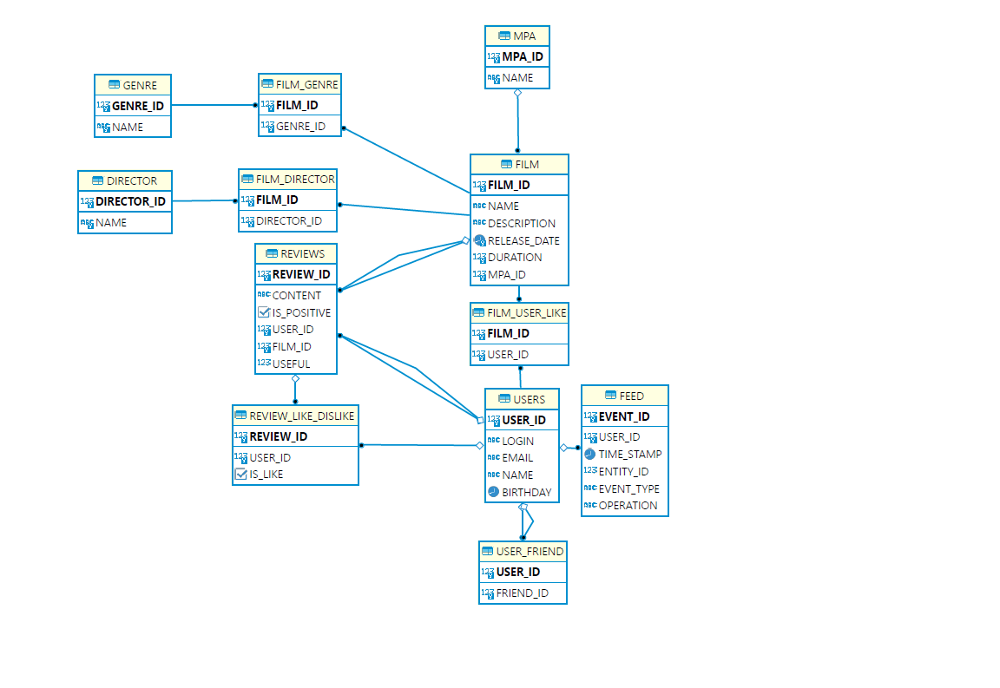

# java-filmorate

An application that helps you decide which movie to watch in the evening. It's a social network that allows users to add movies, like/dislike them, receive recommendations, and find friends based on their interests. Movies within the application are categorized by genres and MPAA ratings.

### Stack
- Java 11
- Spring Boot
- Lombok
- Maven
- Junit
- JDBC
- SQL
- H2

### Functionality:
- Creation, editing, and deletion of user profiles
- Retrieval of a list of all users
- Adding/removing friends
- Retrieval of a user's list of friends
- Retrieval of a list of mutual friends between two users
- Retrieval of ratings and getting a rating by ID
- Retrieval of genres and getting a genre by ID
- Creation and editing of movie cards
- Ability to like/dislike a movie
- Retrieval of a list of all movies
- Retrieval of a movie by ID
- Retrieval of a list of most popular movies

## Team Composition for Gaining Experience in Group Project:

- [Georgii Tatevosian](https://github.com/geo-tat) - Team Lead
- [Daria Serova](https://github.com/dserova)
- [Ruslan Zakharov](https://github.com/14winter)
- [Olga Obraztsova](https://github.com/olgaobraztsova)

## Task Distribution for Additional Features ([Board](https://github.com/users/geo-tat/projects/1))

- Georgiy:
    - [x] "Deletion of Movies and Users" Functionality
    - [x] "Reviews" Functionality
- Olga:
    - [x] "Recommendations" Functionality
    - [x] "Search" Functionality
- Daria:
    - [x] "Popular Movies" Functionality
    - [x] "Movies by Directors" Functionality
- Ruslan:
    - [x] "Activity Feed" Functionality
    - [x] "Shared Movies" Functionality

## Database Structure

